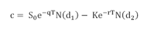
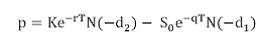
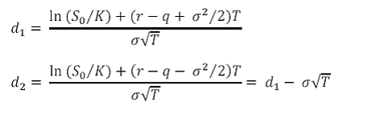
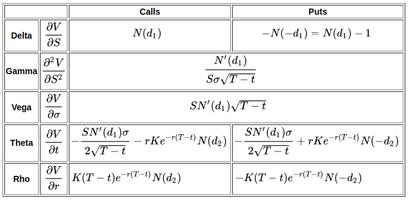

# Stock Trading Guide

**Table of Contents**

- [Why Trade Options](#why-trade-options)
- [Why Sell Options](#why-sell-options)
- [What is the VIX](#what-is-the-vix)
- [How Options Are Priced](#how-options-are-priced)
- [Greeks](#greeks)
- [How to Trade Options](#how-to-trade-options)
  - [Select Asset Universe](#select-asset-universe)
  - [Select Underlying Asset for a Trade](#select-underlying-asset-for-a-trade)
  - [Define the Trade](#define-the-trade)
    - [Target Portfolio Allocation](#target-portfolio-allocation)
    - [Max Capital Allocation per Trade](#max-capital-allocation-per-trade)
    - [Duration](#duration)
    - [Directional Assumption](#directional-assumption)
    - [Strategy Selection](#strategy-selection)
    - [Delta Selection and Theta Goals](#delta-selection-and-theta-goals)
    - [Early Management](#early-management)
    - [Loss Management](#loss-management)

---

## Why Trade Options

The **Efficient Market Hypothesis (EMH)** proposes that financial instruments are traded at fair values based on available information. There are three types of measures that reflect different levels of information in prices.

| EMH Form                                 | Weak EMH                                 | Semi‐strong EMH                                                             | Strong EMH                                                  |
| ---------------------------------------- | ---------------------------------------- | --------------------------------------------------------------------------- | ----------------------------------------------------------- |
| View on Technical Analysis               | Considers it useful                      | May not lead to consistent success                                          | Rejects its significance                                    |
| View on Fundamental Analysis             | Considers it useful                      | Considers it useful                                                         | Rejects its significance                                    |
| View on Trading with Private Information | Considers it potentially exploitable     | Trading on private information might be profitable                          | Even insider trading would not result in consistent success |
| View on Market Inefficiencies            | Market inefficiencies can be exploited   | May exist, but fundamental analysis alone may not consistently exploit them | No exploitable market inefficiencies exist                  |
| Recommended Trading Strategy             | Trade based on exploiting inefficiencies | Incorporate private information along with analysis                         | Favor low-cost passive index funds                          |

Hence, the **EMH** asserts that market prices encompass all available information, posing challenges for traders seeking to gain an advantage or consistently outperform the market through technical analysis, fundamental analysis, or insider information.

However, options trading presents distinct advantages over EMH, particularly in highly liquid markets where assumed inefficiencies are minimal. Rather than relying on price forecasts based on perceived inefficiencies, this approach concentrates on trading options according to current market conditions and directional volatility assumptions.

Here are some additional benefits of options trading:

1. **Leverage:** Options enable traders to control a larger position of an underlying asset with a comparatively smaller investment, thanks to leverage. This magnifies potential gains if the trader's market view proves accurate. Leverage empowers traders to achieve higher returns compared to the capital they have invested.

2. **Hedging and Risk Management:** Options serve as effective tools for hedging and managing risk. Traders can utilize options contracts to safeguard their portfolios against adverse price movements or volatility. By assuming positions in options contracts that function as insurance, traders can offset potential losses in other investments, thereby reducing overall risk exposure.

3. **Flexibility:** Options offer flexibility in trading strategies. Traders can employ various options strategies such as buying calls or puts, selling covered calls, or constructing complex strategies like spreads and combinations. This flexibility enables traders to adapt to different market scenarios and profit from anticipated price movements, regardless of their direction.

4. **Income Generation:** Options can be utilized to generate income through strategies like selling covered calls or cash-secured puts. By leveraging time decay and collecting premiums, traders can earn consistent income, even in a market considered efficient.

5. **Risk/Reward Customization:** Options allow traders to tailor risk/reward profiles according to their specific preferences and market outlook. Depending on their risk tolerance and desired return, traders can design options positions that offer asymmetrical risk/reward ratios, limited risk with unlimited profit potential, or controlled risk with a higher probability of success.

## Why Sell Options

In the long term, sellers of options, known as short premium traders, have a statistical advantage over buyers due to their ability to leverage the risk profiles and profit opportunities provided by options in an efficient market. They consistently outperform the market by capitalizing on the trade-off of risk. Options are priced efficiently based on market risk, making short premium positions more profitable than long premium positions, although they carry the risk of larger losses when unexpected price movements occur. The risk profiles of options can be represented using probability distributions. This is confirmed by the fact that 70 to 90 percent of CME options held until expiration end up being worthless.

Implied volatility (IV) serves as a measure used by traders to evaluate the perceived risk within the market. It reflects the level of volatility that would render the current market price of an option fair according to the Black-Scholes model. IV acts as an indicator of market risk sentiment, determined by the supply and demand for financial insurance. It signifies the expected magnitude of price movements without specifying the direction.

Historical data demonstrates that implied volatility tends to overstate actual price movements more frequently than predicted by theory. For instance, between 2016 and 2021, the estimated IV for SPY exceeded the realized move 87% of the time, whereas theory suggests that it should overstate the realized move approximately 68% of the time. However, actual price movements surpassed expectations only 13% of the time, indicating that IV seldom underestimates the real risk in the market. The degree of this overstatement varies depending on the specific instrument under analysis.

## What is the VIX

The CBOE Volatility Index (VIX) tracks the implied volatility (IV) for the broader market represented by SPY. The VIX measures the perceived risk of the market and helps traders gauge market uncertainty.

The VIX can be classified into three states:

| VIX State   | Time Distribution | Characteristics                                  |
| ----------- | ----------------- | ------------------------------------------------ |
| Lull        | Approximately 70% | Low uncertainty, gradual price increase.         |
| Expansion   | Approximately 10% | Higher uncertainty, significant price movements. |
| Contraction | Approximately 20% | Decreased volatility.                            |

Implied volatility tends to revert back to a long-term value following a cyclic trend, unlike stock prices that generally drift over time. It reflects the market's uncertainty sentiment, which cannot remain high indefinitely.

This can be seen in the frequency of VIX Levels from 2005–2021.

| VIX Range | Percentage of Occurrences |
| --------- | ------------------------- |
| 0–15      | 43%                       |
| 15–25     | 40%                       |
| 25–35     | 11%                       |
| 35+       | 6%                        |

Trading short premium in elevated IV is advantageous due to higher premium prices and the increased likelihood of significant volatility contraction. Although losses may be larger in dollar amounts, the exposure to outlier risk is generally lower compared to trading in equilibrium IV levels. This makes trading in high IV environments generally less risky compared to low IV. However, trading in low IV can still be profitable on average.

During periods of volatility contraction, it is favorable for options traders to sell premium because volatility decreases. This allows them to buy back positions at a lower price and profit from the price difference. Conversely, volatility expansions pose a risk for short premium traders, potentially leading to significant losses.

While unexpected transitions from low-volatility periods (lulls) to high-volatility periods (expansions) are infrequent, they can have a detrimental impact on short premium traders. Therefore, it is crucial to implement effective risk management strategies during low-volatility periods to mitigate potential risks and protect against adverse market conditions. One effective strategy involves prioritizing ETFs and Index funds during periods of low implied volatility (IV). This approach is grounded in the understanding that a significant increase in IV typically requires a widespread systemic risk across the market, whereas individual companies may experience volatility spikes due to news releases.

Effectively managing exposure to outlier risk in different volatility environments requires maintaining small position sizes and carefully allocating portfolio capital in short premium trading. Scaling down the allocation in low IV environments protects portfolio capital from unexpected market volatility, while scaling up the allocation in high IV environments increases the potential for higher profits and reduced outlier risk.

Short premium traders should focus on minimizing outlier losses and optimizing their position sizes and portfolio exposure based on market conditions. Adhering to guidelines for portfolio capital allocation (as determined by the amount of Buying Power Reduction discussed later) can help traders determine the maximum allocation percentage based on the prevailing IV range.

### Guidelines for Portfolio Capital Allocation according to IV Range

| VIX Range | Max Margin Portfolio Allocation | Max IRA Portfolio Allocation |
| --------- | ------------------------------- | ---------------------------- |
| 0–15      | 25%                             | 80%                          |
| 15–20     | 30%                             | 90%                          |
| 20–30     | 35%                             | 95%                          |
| 30–40     | 40%                             | 100%                         |
| 40+       | 50%                             | 100%                         |

By following these guidelines, short premium traders can effectively manage risk and optimize their trading strategies.

## How Options Are Priced

The Black-Scholes options pricing model, introduced in 1973, estimates the theoretical price of options. Implied volatility is the deviation from the theoretical option price and the actual price, reflects market participants' perception of risk.

Call Option price (c)



Put Option price (p)





Where:
| Variable | Explanation |
|----------|-------------|
| N(x) | Cumulative probability distribution function (pdf) for a standardized normal distribution |
| S₀ | Price of the underlying asset at time zero |
| K | Strike or exercise price |
| r | Continuously compounded risk-free rate |
| σ | Volatility of the asset price |
| T | Time to maturity of the option |
| q | Yield rate on the underlying asset. Alternatively, if the asset provides cash income, q will be set to zero in the formula, and the present value of the cash income during the life of the option will be subtracted from S₀ |

Some key points to remember about the Black-Scholes model is that it assumes stock prices are subject to uncertainty and follow a log-normal distribution, while volatility is estimated using measures such as historical volatility or the standard deviation of past returns and held constant.

## Greeks

The Greeks are a set of risk measures derived from the Black-Scholes model, and they are important metrics for options traders. The three essential Greeks are delta, gamma, and theta.

Delta is a first-order Greek that measures the expected change in an option's price with a $1 increase in the price of the underlying asset. It indicates the degree of directional risk and the severity of exposure. A larger delta magnitude means a higher profit and loss potential.
Gamma is a second-order Greek that measures the expected change in the option's delta with a $1 change in the underlying price. It reflects how the delta of long and short positions will be affected. A $1 increase in the underlying price makes long calls more positive and long puts more negative.

Theta is a first-order Greek that measures the expected profit/loss changes resulting from the decay of an option's extrinsic value per day. It represents the time decay of the option. The extrinsic value decreases the value of long positions and increases the value of short positions. Theta is highest for at-the-money (ATM) options and lower for in-the-money (ITM) and out-of-the-money (OTM) options.

There is a trade-off between gamma and theta. A position with a large, positive gamma will experience a large amount of negative time decay (theta).



## How to Trade Options

Options provide the flexibility to customize risk and reward profiles, and the choice of strategy and contract parameters plays a crucial role in shaping these profiles. To execute successful trades, it is important to follow a specific procedure. By following these steps and considering the mentioned factors, traders can construct trades that complement existing positions, provide diversification, and align with their risk preferences and market outlook.

### Select Asset Universe

Start by selecting assets for trading, which are underlying that willing to be owned with the following criterions.

After applying the specified filters, all desired stocks, ETFs, and futures with options are included. The futures options do not require the same filtering process, as they are limited in number and will be filtered based on acceptable underlying assets and strike prices according to the trading strategy.

Trading options on futures offers three key advantages compared to trading stock options and futures directly:

1. Greater potential for diversification
2. Improved margin leverage
3. Consistent supply of overpriced options to sell due to high volatility.

### Select Underlying Asset for a Trade

When selecting underlying assets for options trading, consider personal preferences, volatility environment, and directional beliefs. While not necessary, giving preference to assets with high IV can be beneficial.

When many different assets are tradable, it is difficult to know what IV is high for a given underlying. Thus, Implied Volatility Rank (IVR) compares the current IV level to the historical range over the past 52 weeks, ranging from 0 to 100, where higher values indicate higher relative IV.

Similarly, Implied Volatility Percentile (IVP) quantifies the degree of IV elevation over a specific timescale, representing the percentage of days in the past year with lower IV. Both IVR and IVP help evaluate option prices, with IVP offering relative analysis and IVR providing a direct metric for asset comparison.

### Define the Trade

After selecting an asset to trade, the following procedures help determine what strategy to employ:

#### Target Portfolio Allocation

After selecting an asset to trade, use the following target portfolio allocation as a guideline for diversification and risk management:

15%: Futures and futures options
35%: Stock options
50%: Cash, equities, debit spreads, or other instruments
These percentages represent suggested maximum allocations and help ensure a balanced portfolio across different asset classes.

#### Max Capital Allocation per Trade

It is generally recommended that a single asset should not exceed 5–7% of the portfolio’s capital, as measured by buying power reduction (BPR). This approach helps maintain diversification and balance. BPR is the capital required to maintain a short premium trade and serves as a reliable estimate of the worst-case loss in current market conditions for positions with undefined risk. Typically, BPR is designed to cover approximately 95% of potential losses for ETF underlyings and 90% for stock underlyings. Note that BPR should only be used to compare identical strategies.

For futures and futures options positions:

- Allocate 30% less capital than you would for similar equity positions.
- Limit the size of any single futures trade to 2–4% of net liquidation value (net liq).
- The total allocation to all futures positions should not exceed 20–25% of net liq.

##### Kelly Criterion and Fractional Betting

The Kelly Criterion is a mathematical formula used to determine the optimal size of a series of bets to maximize long-term capital growth, based on the probability of winning and the payout ratio. While betting the full Kelly amount maximizes expected growth, it also leads to higher volatility in returns.

Using a fraction of the Kelly amount is a common risk management practice:

- Betting 50% of the Kelly amount yields approximately 75% of the Kelly-optimal profit, but with only one-quarter the variance.
- Betting 30% of the Kelly amount yields about 51% of the Kelly-optimal profit, with just one-eleventh the variance.

Fractional Kelly betting provides a balance between growth and risk, reducing portfolio volatility while still achieving a significant portion of the potential gains.

#### Duration

Upon establishing the underlying contract and determining the max available BPR for a particular position, it becomes necessary to consider the directional assumptions and duration of the trade. The directional assumption can be bullish, bearish, or neutral. When selecting the duration of an options contract, factors such as effective utilization of portfolio BPR, trade consistency, and contextual information need to be considered.

Opting for longer durations provides ample time for evaluation and adjustments, but it ties up buying power. Shorter durations result in greater volatility in profit or loss and limit the time available for reacting to market changes. The number of trade occurrences plays a pivotal role in calculating long-term averages, with a minimum of approximately 200 occurrences being desirable. A contract duration of 30 to 60 days strikes a balance between these considerations. This duration allows for the acceleration of theta and enables the achievement of desired objectives. By adhering to this time frame, traders can make informed decisions while considering various trade dynamics.

#### Directional Assumption

When selecting the duration of options contracts, it is important to choose a directional assumption. This choice can be based on personal preference for a specific underlying asset, but it is crucial to consider the degree of assumption (based on delta) in relation to other trades within the portfolio. Certain Greeks like delta and theta can be aggregated across positions with different underlying assets. This allows these metrics to provide a summary of the various sources of risk in the portfolio and guide adjustments. Therefore, it is beneficial to beta-weight delta for a position, as it helps measure the portfolio's directional bias and systematic risk. Beta-weighted delta represents the expected change in delta with a $1 price change in the reference index (e.g., SPY). Hence, a single position should not be selected in isolation; it is likely best to avoid excessive long or short positions at the portfolio level.

#### Strategy Selection

With the directional assumption selected, the option strategy needs to be chosen based on the following table.

| Strategy                  | Direction | Delta    | Debt/Credit    | Why to Trade                                                                                                                                                                                                                                                                                                                                                                                                                  | Best IV Environment | Made of:                              |
| ------------------------- | --------- | -------- | -------------- | ----------------------------------------------------------------------------------------------------------------------------------------------------------------------------------------------------------------------------------------------------------------------------------------------------------------------------------------------------------------------------------------------------------------------------- | ------------------- | ------------------------------------- |
| **Single Leg**            |           |          |                |                                                                                                                                                                                                                                                                                                                                                                                                                               |                     |                                       |
| Long Stock                | Bullish   | Positive | N/A            | Buying and holding shares of a company, aiming for profit from price appreciation over time.                                                                                                                                                                                                                                                                                                                                  | N/A                 |                                       |
| Long Call                 | Bullish   | Positive | Debit          | A Long Call is used when an investor expects the underlying asset to rise in price, allowing for potential profit with limited risk.                                                                                                                                                                                                                                                                                          | Low IV              |                                       |
| Short Call                | Bearish   | Negative | Credit         | A Short Call is employed in a bearish market to generate income; the trader believes the underlying asset will decrease in value or remain stagnant.                                                                                                                                                                                                                                                                          | High IV             |                                       |
| Long Put                  | Bearish   | Negative | Debit          | A Long Put is utilized when an investor anticipates a decline in the underlying asset's price, enabling potential profit with limited risk.                                                                                                                                                                                                                                                                                   | Low IV              |                                       |
| Short Put                 | Bullish   | Positive | Credit         | A Short Put strategy is employed when the investor is bullish on the underlying asset, aiming to profit from price stability or an increase in value.                                                                                                                                                                                                                                                                         | High IV             |                                       |
| **Spreads**               |           |          |                |                                                                                                                                                                                                                                                                                                                                                                                                                               |                     |                                       |
| Call Credit Spread        | Bearish   | Negative | Credit         | A Call Credit Spread is implemented when the trader expects a decrease in the underlying asset's price and aims to profit from the premium received.                                                                                                                                                                                                                                                                          | High IV             | Short Call: Long Call                 |
| Call Debit Spread         | Bullish   | Positive | Debit          | A Call Debit Spread is used in a bullish market; it allows for potential profit if the underlying asset's price rises, while limiting potential losses.                                                                                                                                                                                                                                                                       | Low IV              | Long Call: Short Call                 |
| Put Credit Spread         | Bullish   | Positive | Credit         | A Put Credit Spread is employed when the investor is bullish and expects the underlying asset's price to remain stable or increase, generating income.                                                                                                                                                                                                                                                                        | High IV             | Long Put: Short Put                   |
| Put Debit Spread          | Bearish   | Negative | Debit          | A Put Debit Spread is utilized in a bearish market; it allows for potential profit if the underlying asset's price decreases, while limiting potential losses.                                                                                                                                                                                                                                                                | Low IV              | Short Put: Long Put                   |
| Covered Calls             | Bullish   | Positive | Cost Reduction | Covered Calls are employed by investors who own the underlying asset and want to generate additional income by selling call options against their holdings.                                                                                                                                                                                                                                                                   | Low IV              | Long Stock: Short Call                |
| **Neutral Undefined**     |           | Varies   | Credit         |                                                                                                                                                                                                                                                                                                                                                                                                                               |                     |                                       |
| Short Strangle            | Neutral   | Varies   | Credit         | A Short Strangle strategy is used when the trader expects low price volatility; it generates income by selling both an out-of-the-money call and put option.                                                                                                                                                                                                                                                                  | High IV             | Short Put: Short Call                 |
| **Directional Undefined** |           |          |                |                                                                                                                                                                                                                                                                                                                                                                                                                               |                     |                                       |
| Covered Short Strangle    | Bullish   | Positive | Cost Reduction | A Covered Short Strangle involves holding the underlying asset while selling both a call and a put option, aiming to reduce costs and generate income.                                                                                                                                                                                                                                                                        | High IV             | Short Put: Long Stock: Short Call     |
| Jade Lizard               | Bullish   | Positive | Credit         | The Jade Lizard strategy combines a short put with a short call spread to generate credit, often used when the trader is moderately bullish on the asset.                                                                                                                                                                                                                                                                     | High IV             | Short Put: Call Credit Spread         |
| Reverse Lizard            | Bearish   | Negative | Credit         | The Reverse Lizard strategy combines a short call with a long call spread to generate credit, typically used when the trader is moderately bearish on the asset.                                                                                                                                                                                                                                                              | High IV             | Put Credit Spread: Short Call         |
| Ratio Call Spread         | Neutral   | Negative | Credit         | A Call Ratio Spread is utilized by traders with a mildly bullish outlook, involving the purchase of a long call option combined with a larger quantity of out-of-the-money short calls. This strategy, executed for a net credit, offers the potential for profit if the underlying asset's price rises moderately or remains stable, providing a flexible approach to capitalize on upward movements while mitigating risks. | High IV             | Call Debit Spread: Short Call         |
| Ratio Put Spread          | Neutral   | Positive | Credit         | A Put Ratio Spread is implemented when an investor anticipates a neutral to bearish market, combining a long put option with a higher quantity of short out-of-the-money puts, enabling a net credit and offering profit potential if the underlying asset's price stays stable or moves slightly lower.                                                                                                                      | High IV             | Short Put: Put Debit Spread           |
| **Defined Neutrals**      | Varies    | Credit   |                |                                                                                                                                                                                                                                                                                                                                                                                                                               |                     |                                       |
| Long Iron Condor          | Neutral   | Varies   | Credit         | A Long Iron Condor is employed when the trader expects little price movement; it profits from limited price movement by combining a bull put spread with a bear call spread.                                                                                                                                                                                                                                                  | High IV             | Put Credit Spread: Call Credit Spread |
| Long Put Butterfly        | Varies    | Varies   | Debit          | A Long Put Butterfly is used when the trader expects low price movement and aims to profit from a sharp move in the underlying asset's price in either direction.                                                                                                                                                                                                                                                             | High IV             | Put Credit Spread: Put Debit Spread   |
| Long Call Butterfly       | Varies    | Varies   | Debit          | A Long Call Butterfly is utilized when the trader expects low price movement and profits from a sharp move in the underlying asset's price in either direction.                                                                                                                                                                                                                                                               | High IV             | Call Debit Spread: Call Credit Spread |

##### Undefined vs. Defined Risk Allocation

Undefined risk strategies offer higher profit potential but also come with significant tail risk, as well as more negatively influenced by expansion in IV. It is generally recommended to allocate at least 75% of the portfolio capital to undefined risk strategies, with a maximum allocation of 7% per trade. On the other hand, defined risk strategies should make up no more than 25% of the portfolio capital, with a maximum allocation of 5% per trade. It is import to remember that diversification helps remove tail-risk from returns and can be achieved by not only training various assets, but also by trading different expirations, using different directional assumptions and strategies. This diversification helps reduce systemic risks that are inherent to the market as a whole such as market wide IV expansion.

#### Delta Selection and Theta Goals

When selecting a delta for a position, it is important to choose a value that aligns with the beta-weighted deltas required for the portfolio, while also staying below the maximum buying power reduction (BPR) limit. It is worth noting that the delta selection also affects gamma and theta. While gamma cannot be beta-weighted like delta, there is a positive relationship between gamma and theta that can be considered. The theta ratio serves as an indicator of excessive gamma risk since theta is higher when gamma is higher. This relationship emphasizes the need for short premium traders to balance the profitability of time decay with the potential profit and loss fluctuations resulting from gamma. Therefore, the delta chosen should also align with the desired theta goals.

The easiest way to do this is by evaluating the theta ratio, which estimates the expected daily profit per unit of capital for a short premium portfolio. To justify taking on the significant tail risk associated with options portfolios, the expected daily profit should be substantially higher compared to a passively invested portfolio in the market. The following table presents a comparison of daily performance statistics for different portfolios passively invested in SPY from 2011 to 2021, with varying initial capital allocations ranging from 25% to 50%. This table can be used as a benchmark to assess the profit goals of an equivalent short options portfolio by comparing its daily profit/loss performance to the SPY portfolios.

| SPY Allocation Percentage | Daily Portfolio P/L (2011–2021) |
| ------------------------- | ------------------------------- |
| 25%                       | 0.01%                           |
| 30%                       | 0.02%                           |
| 35%                       | 0.02%                           |
| 40%                       | 0.02%                           |
| 50%                       | 0.03%                           |

To justify the tail risks associated with short premium positions, most traders should aim for a theta ratio ranging from 0.05% to 0.3% of portfolio net liquidity. This means that short premium portfolios should have a daily expected profit between $50 and $300 per $100,000 of portfolio buying power resulting from decay.

| Monthly Interest Rate | Total Return after a Year (%) | Total Profit with Initial $100,000 | Average Monthly Profit | Average Daily Theta |
| --------------------- | ----------------------------- | ---------------------------------- | ---------------------- | ------------------- |
| 0.5%                  | 6.1687                        | $6,168.70                          | $514.06                | $16.95              |
| 1%                    | 12.6825                       | $12,682.50                         | $1,056.88              | $34.71              |
| 1.5%                  | 19.4223                       | $19,422.30                         | $1,618.53              | $53.08              |
| 2%                    | 26.8202                       | $26,820.20                         | $2,235.02              | $73.43              |
| 2.5%                  | 34.8614                       | $34,861.40                         | $2,905.12              | $95.37              |
| 3%                    | 43.5525                       | $43,552.50                         | $3,629.38              | $119.16             |
| 3.5%                  | 52.8999                       | $52,899.90                         | $4,408.32              | $144.55             |
| 4%                    | 62.9109                       | $62,910.90                         | $5,242.58              | $172.48             |
| 4.5%                  | 73.5928                       | $73,592.80                         | $6,132.73              | $201.79             |
| 5%                    | 84.9523                       | $84,952.30                         | $7,079.36              | $231.80             |

However, it is cautioned that the theta ratio should not exceed 0.3%. While a higher theta ratio is preferable, excessively high theta ratios can introduce hidden gamma risk, which can allow for rapid whipsawing action in portfolio capitalization.

##### ROC/Day Table

| ROC/Day per Percent of Portfolio Allocated | 5\% | 10\% | 15\% | 20\% | 25\% | 30\% | 35\% |
| ------------------------------------------ | --- | ---- | ---- | ---- | ---- | ---- | ---- |
| 0.25\%                                     | 5%  | 9%   | 14%  | 18%  | 23%  | 27%  | 32%  |
| 0.33\%                                     | 6%  | 12%  | 18%  | 24%  | 30%  | 36%  | 42%  |
| 0.50\%                                     | 9%  | 18%  | 27%  | 37%  | 46%  | 55%  | 64%  |
| 0.75\%                                     | 14% | 27%  | 41%  | 55%  | 68%  | 82%  | 96%  |
| 1\%                                        | 18% | 37%  | 55%  | 73%  | 91%  | 110% | 128% |

This corresponds to an average monthly return of 3%, with a conservative estimate of 2.5% or an aggressive estimate of 3.5%.

##### Formulas for Portfolio Variables

Alternatively, the formula can be adapted to compute various other portfolio variables, such as Year % Profit (Y), Fraction of Portfolio Allocated (P), ROC/Day (R), and % Time in IV (I).

**To determine Year % Profit (Y):**

```text
Y = P * R * 365
```

**To determine ROC/Day (R):**

```text
R = Y / (P * 365)
```

**To determine Fraction of Portfolio to Allocate (P):**

```text
P = Y / (R * 365)
```

When examining historical data, % Time in IV (I) is 43% in the 0-15 IVR range, corresponding to P of 25%, and 40% in the 15-25 IVR range, corresponding to P of approximately 32.5%.

```text
((I{43} * P{25}) + (I{40} * P{32.5})) / (I{43} + I{40}) * R{25} * 365 = Y{26}
```

Assuming only 50% of Y is retained, the expected return is approximately 13% each year.

Alternatively the average theta can be calculated with the following formula assuming that 1/4 of theta is kept.

```text
theta = ((Account Size * Y) / 365) * 4
```

#### Early Management

It is worth noting that there are potential advantages to closing or managing positions early. Such an approach can be profitable by taking advantage of partial theta decay and IV contractions, while also reducing trade variability.

As options approach expiration, their price sensitivity (delta) becomes increasingly unstable due to growing gamma risk, resulting in greater fluctuations in profit and loss during the latter half of the contract duration compared to the initial half. Therefore, it is often advisable to close or roll a position at 21 days to expiration (DTE), regardless of profit or loss. Additionally, if a certain percentage of profit is achieved quickly, it may be preferable to close the position and seek another opportunity. Managing trades at 21 DTE or 50% profit has shown to cause

1. ~ 30% higher average daily P/L
2. ~ 60% lower per-trade P/L standard deviation
3. ~ 60% lower per trade CVAR outlier risk

By doing this however, it should be expected to retain between a conservative average of 20% and an aggressive 30% of the initial credit received.

POP tends to remain approximately the same if you hold to expiration or mange early. However, managing at 21 DTE or 50% profit:

1. nearly 30% higher average P/L
2. nearly 60% lower per-trade P/L standard deviation
3. nearly 60% lower per-trade CVAR (outlier risk)

#### Loss Management

- Do not add to losing positions.
- Reduce contract size by 25-35%.
- Hedge at least 20-25% with the underlying.
